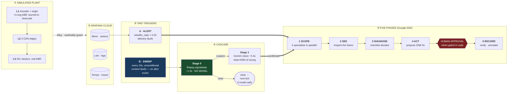

<div align="center">

# 📺 DEAD AIR

### Autonomous Broadcast Operations Agent for Live Video

**An agent that watches live video the way a broadcast engineer does — by looking at the picture — and catches the failures delivery telemetry is structurally blind to.**

[](LICENSE)
[](https://google.github.io/adk-docs/)
[](https://cloud.google.com/vertex-ai)
[](https://grafana.com/)
[](docs/agent.md)

</div>

---

## The problem

**Delivery telemetry measures whether *bytes* arrived. It cannot see whether those bytes contain a *picture*.**

When an encoder's input goes black, or its source freezes on one frame, the segments keep flowing on schedule. Bitrate is nominal. Segment latency is flat. Error rates are zero. **Every panel is green — and every viewer is staring at a black rectangle.**

This is not a hypothetical gap. It is the documented behaviour of the broadcast chain:

> "Processing equipment within the broadcast chain may choose to freeze on the last active image or go to a black image when a signal is lost. **The transmission system considers this image as an active signal and may not alert the operator to the fault within the system.**"
>
> — Tektronix, [*Black and Frozen Frame Detection*](https://download.tek.com/document/2PW-24654-0.pdf) (WFM/WVR waveform monitors)

Modern streaming monitoring inherits the same blind spot, because it watches the transport:

> "A stream may start successfully, report normal bitrate, and show no errors in monitoring tools, **while the viewer is stuck on a black screen with no way to recover.**"
>
> — Witbe, [*Why QoS video monitoring fails to reflect real user experience at scale*](https://www.witbe.net/articles/why-video-quality-monitoring-fails-user-experience/)

And the clock is expensive while nobody notices. New Relic's *State of Observability for Media and Entertainment* reports that **high-impact outages cost media companies an average of $2 million per hour**, and take **around 40 minutes to resolve** ([press release, Oct 2025](https://newrelic.com/press-release/20251028) — vendor survey of engineering leaders, self-reported).

### Measured, on this plant

DEAD AIR ships with the broadcast plant it observes, so the premise is demonstrated rather than asserted. Inject a source blackout and every delivery signal holds:

| Signal | Under a total blackout | |
| --- | --- | --- |
| `encoder_fps` | 30.0 | unchanged |
| `dropped_frames` | 0 | unchanged |
| `packager_segment_lag` | normal sawtooth | unchanged |
| Edge cache hit ratio | ~98% | unchanged |
| `rebuffer_ratio` | **~0.0002** against a **0.02** alert threshold | ~100× below the line |
| **Alert state after 10 minutes of black** | **`Normal`, all three regions** | **zero webhooks fired** |

There is no delivery-telemetry baseline to beat for this fault class. **No threshold is crossed, so no alert can ever fire.** An alert-driven agent sleeps through it forever. The honest comparison is not *faster detection* — it is *detection at all*.

---

## The product

DEAD AIR runs a **confidence monitor**: it continuously pulls the actual HLS segment being served to viewers and screens the pixels, exactly as a broadcast operations desk watches a confidence feed. When something looks wrong it:

- **Scopes** the incident across metrics, logs and traces — four specialists querying Grafana Cloud concurrently through a self-hosted Grafana MCP server.
- **Sees** the frame — fetches the real segment from the affected edge and classifies the picture, reading the burned-in timecode to tell a *dead source* from a *frozen* one.
- **Diagnoses** from a deterministic evidence checklist. Gemini ranks which hypotheses are worth testing; **code runs the confirming checks and computes the verdict.**
- **Proposes** exactly one remediation from a fixed table, and **stops for human approval** — enforced by a token only a person can issue, not by a prompt.
- **Verifies recovery** with the check that fault class actually requires, then annotates the Grafana dashboard and files a postmortem.

It is also **an observable service in its own right**: its traces, token counts and estimated cost land in the same Grafana stack it investigates.

---

## Architecture at a glance



Full diagram and the reflexive loop in **[docs/architecture.md](docs/architecture.md)**.

> **Why two triggers, and why a cascade — not a model on every tick?**
>
> The sweep is **first-class, not a fallback.** `black_source` moves no metric, so no alert can exist for it; an alert-only agent is architecturally incapable of catching the fault this project is named after. Real broadcast operations run a confidence monitor for exactly this reason.
>
> But a model on every tick is unaffordable, and it was: before the cascade, every sweep tick ran a full investigation, so the cadence floor was the pipeline's own runtime and "catches it in seconds" was untrue at any interval. **Deciding whether a frame is black is arithmetic.** Deciding *what kind* of wrong it is, is worth a model. Splitting those is what makes continuous watching cheap enough to actually run — a healthy plant now makes **zero vision calls per hour**.

### What is decided by code, not by the model

This is the load-bearing design choice, so it is worth listing exactly:

| Decision | Decided by | Where |
| --- | --- | --- |
| Is the picture black | `ffmpeg signalstats` YAVG/YHIGH thresholds | [`content_screen.py`](agents/dead_air/content_screen.py) |
| Does a rung carry its detail | round-trip PSNR ratio | [`rung_resolution_check.py`](scripts/rung_resolution_check.py) |
| Which fault the evidence supports | fixed predicates over collected evidence | [`signatures.py`](agents/dead_air/signatures.py) |
| Which remediation to propose | fixed fault→action table, via a **forced** tool call | [`act_tools.py`](agents/dead_air/act_tools.py) |
| **Whether it may execute** | **a token only a human can issue** | [`act_tools.py`](agents/dead_air/act_tools.py) |
| Which SLO verifies recovery | fault class, dispatched in code | [`act_tools.py`](agents/dead_air/act_tools.py) |
| Viewer impact | arithmetic over a measured window | [`act_tools.py`](agents/dead_air/act_tools.py) |

The model ranks hypotheses, explains, and writes for humans. **Evidence decides.** Where the two disagree, the disagreement is recorded rather than resolved silently — and a fault whose required checks cannot be evaluated comes back **`unconfirmable`, never `ruled_out`**, because missing evidence must never masquerade as elimination.

---

## The plant

DEAD AIR ships with the streaming system it observes — there is no point building a detector with nothing to detect. Four layers, all in Docker:

| Layer | What | Exports |
| --- | --- | --- |
| **L1** | ffmpeg encoder → nginx origin. 4-rung ABR HLS ladder (1080p/5M · 720p/3M · 480p/1.5M · 360p/800k, 4s segments) with **burned-in timecode** | `encoder_fps`, `dropped_frames`, `packager_segment_lag`; access logs → Loki |
| **L2** | 3 caching edges standing in for `us-east1`, `europe-west1`, `asia-south1` | cache hit ratio, segment status, TTFB histograms, per-region fault injection |
| **L3** | 201 modeled viewer sessions on a real playback clock with ABR and per-device buffers | `rebuffer_ratio` — a client-side signal no CDN metric can produce |
| **L0** | a synthetic canary, deliberately unrelated to video | answers "is the PLANT broken, or the PIPE?" |

The burned-in timecode is load-bearing, not decoration: **a running clock over a black picture means the encoder is alive and the SOURCE is dead; a stopped clock means the source froze.** That one field separates two faults that are otherwise pixel-identical.

**Cardinality is guarded at the collector.** A streaming plant is the classic way to blow a metrics budget — one series per viewer, per request, or per 4-second segment. Per-session detail goes to Loki in the log *line*, never as a label. Whole plant: **172 active series** against a ~10k free-tier budget, proven in both directions by deliberate canaries.

### The fault menu

Five faults, each with a measured signature — the answer key the agent is graded against:

| Fault | rebuffer | bitrate | 4xx | The tell |
| --- | --- | --- | --- | --- |
| `edge_latency` | 0.44, **one region** | drops, that region | none | regional, not plant-wide |
| `segment_gap` | ~0.05, all regions | unchanged | **sustained** | packager fault |
| `ladder_collapse` | zero | 3.6 → 2.0 Mbps | **transient, then stops** | manifest drops 4 → 3 rungs |
| `black_source` | **zero** | unchanged | none | **nothing moves** |
| `ladder_mismatch` | **zero** | unchanged | none | **nothing moves** |

The bottom two are invisible in every metric, log and trace — and that is the point. `ladder_collapse` and `segment_gap` both produce 404s, so **presence** of 404s separates nothing; **persistence** does, and the discriminator compares a recent window against an earlier one.

---

## Measured results

Every figure below is measured on the running plant and traceable to a doc in this repo.

| | |
| --- | --- |
| **Diagnostic accuracy** | **6/6** — all five faults plus a healthy control, through the complete five-phase agent |
| **Content screen calibration** | **69/69**, 100% detection, **0% false positives** (6 states × 4 ladder rungs) |
| **Luma separation** | black 17.05–17.12 vs healthy 125.47–125.62 — threshold at 40 sits in a ~100-unit empty gap |
| **Stage 0 cost** | 1.22 / 1.29 / 1.41s (min/median/max), **zero model calls** |
| **Black on air → flagged** | **12.4 / 12.5 / 12.4s** (n=3, 10s sweep) |
| **→ classified fault** | **~18s** |
| **→ full closure, verified recovery** | **3.1 – 4.4 min** |
| **Plant's own floor** | 6.4 – 8.1s — encoder finishing a 4s segment, origin, edge. No detector beats it. |
| **Cost per investigation** | **$0.21** mean (from $1.38 before the context fix) |

### The vision spike that changed the architecture

Before building the SEE phase, vision was run against every fault, on every model tier, in three prompt variants. The result **reshaped the design**:

| Fault | Vision verdict | Who decides |
| --- | --- | --- |
| `black_source` | **detected, 100%, every model and every variant** | vision |
| `ladder_mismatch` | **not detected by any configuration** | **code** |
| `ladder_collapse` / `segment_gap` / `edge_latency` | correctly read as healthy pixels | telemetry |

`gemini-2.5-pro` scored 3/3 on mismatched rungs — and **0/3 on healthy ones**. It answers "upscaled" to everything. That is not detection, it is a constant prior, and it would fire a false source alarm on a healthy stream every time it looked. So **resolution is decided by a round-trip PSNR measurement in code, and vision is never asked** — the enum a model can emit has no "upscaled" option at all, because offering it is what invites the confabulation.

### Making continuous watching affordable

Profiling the agent **through its own traces in Tempo** showed every call after Phase 1 carrying ~200k input tokens — 4.3M input against 17k output, a 250:1 ratio. The cause was not context: ADK's per-agent branch isolation only applies downward from a `ParallelAgent`, so every phase under the sequential spine inherited all four specialists' raw tool payloads. **Nothing downstream read them.**

| | input tokens | wall clock | cost |
| --- | --- | --- | --- |
| `ladder_collapse` | 4,329,077 → **919,973** (−78.7%) | 362.2s → **187.1s** (−48.3%) | $1.34 → **$0.32** |
| `segment_gap` | 4,573,692 → **555,140** (−87.9%) | 568.9s → **243.8s** (−57.1%) | $1.42 → **$0.20** |

Output tokens barely moved. The agent does the same work and says the same things — it was carrying freight, not context.

---

## Repository layout

```
agents/dead_air/    the five-phase agent — scope · see · diagnose · act · record
                    signatures.py (the deterministic checklist) · content_screen.py (Stage 0)
                    observability.py (the reflexive layer) · schemas.py (validated outputs)
agents/grafana_probe/  day-one MCP connectivity probe, kept as honest history
plant/              the streaming system under observation
                    encoder · origin · edge ×3 · viewers · emitter · webhook · alloy
scripts/            run_agent.py (the entry point) · verify_pipe.py (the pipe gate)
                    diagnose_eval.py · profile_agent_run.py · provision_grafana.py
docs/               architecture · demo runbook · plant · agent · calibration · audit
fixtures/frames/    69 committed stills — the content screen's calibration corpus
```

---

## Quickstart

**Requires** Python 3.10+, Docker, **ffmpeg on the host**, a Google Cloud project with Vertex AI enabled, and a Grafana Cloud stack (free tier is enough).

`ffmpeg` is not optional and is not supplied by the venv or Docker Desktop — the content screen, the frame grabs and the rung measurement all shell out to it. Stock macOS and Ubuntu do not ship it.

```bash
git clone https://github.com/kaushikchaturvedula/dead-air.git && cd dead-air

python3 -m venv .venv && source .venv/bin/activate
pip install -r requirements.txt
ffmpeg -version                                    # must print a version

cp agents/grafana_probe/.env.example agents/grafana_probe/.env
# fill it in — every key is documented in the example file, and `make verify`
# fails loudly and BY NAME if any are missing
gcloud auth application-default login
```

### See it work

Three terminals — T1, T2, T3.

```bash
# ---- T1: bring up the plant ----
make plant-up          # 20-42s. Blocks until encoder/origin/edges are healthy.

# WAIT ~2 MINUTES. plant-up returns as soon as the plant is SERVING, but Alloy
# has not yet delivered enough to Mimir. Running verify immediately fails at the
# mimir hop — that is the pipeline being honest, not a broken plant.

make verify            # must print 15/15 PASS
make provision         # dashboard + alert rule; prints the dashboard URL
```

```bash
# ---- T2: START THIS BEFORE OPENING THE DASHBOARD ----
make agent-sweep       # the confidence monitor, 10s cadence
```

The content panels are fed by this sweep. With nothing running there are no samples, and Prometheus serves the last value for ~5 minutes — so the panel carrying the whole thesis would read green over a black stream. Start the sweep, wait ~40s, *then* open the dashboard.

```bash
# ---- browser ----
make player            # the picture

# ---- T3: break it, then fix it ----
make black-source      # the screen goes black; every delivery metric stays green
make restore-source    # and back. Give ABR ~120s to settle before a second run.
```

Watch T2: Stage 0 flags the black frame in **~12.5s** with no model call at all, vision classifies it ~5s later, and the five-phase investigation runs from there.

### Everything else

```bash
make diagnose-eval     # drive all 6 cases through the full agent (the 6/6)
make diagnose-checks   # score the deterministic checklist only — no model, fast
make screen-calibrate  # reproduce the 69/69 content-screen table
make agent-profile     # where a run's time went, read from its own traces
make agent-tools       # which 12 of the 73 MCP tools each specialist sees
make chaos MODE=<fault> [REGION=...]   # inject any of the five faults
make chaos-clear
```

The full beat sheet — measured timings, what to say over each screen, and what to do when something misfires — is in **[docs/demo-runbook.md](docs/demo-runbook.md)**.

<details>
<summary><b>How this was bootstrapped</b> — the day-one MCP connectivity probe</summary>

Before any of the above existed, the first thing built was a bare ADK agent that did nothing but list the Grafana MCP server's tools, to prove a headless agent could authenticate at all. It is still in the repo and still works:

```bash
cd agents && adk web
```

Open the URL it prints, pick the `grafana_probe` agent, and ask it about your stack. The MCP server authenticates with a service-account token — no browser handshake, which is the whole reason it is self-hosted. Grafana's hosted `mcp.grafana.com` endpoint only authenticates through an interactive OAuth 2.1 browser flow, which a headless agent woken by a webhook can never complete.

This is a connectivity check, not the product. The tools it exposes are catalogued in [docs/mcp-tool-inventory.md](docs/mcp-tool-inventory.md).

</details>

---

## Tech stack

| Layer | Choice |
| --- | --- |
| Agent framework | Google ADK (`google-adk`) — `SequentialAgent` spine, `ParallelAgent` fan-out |
| Model | Gemini via Vertex AI (`google-genai`) |
| Observability | Grafana Cloud — Mimir · Loki · Tempo |
| MCP server | [grafana/mcp-grafana](https://github.com/grafana/mcp-grafana), self-hosted via Docker |
| Collector | Grafana Alloy, with a cardinality guard before `remote_write` |
| Plant | ffmpeg · nginx · Python stdlib services · Docker Compose |

**The agent sees 12 of the 73 MCP tools**, no specialist more than 4. 73 tool declarations measurably degrades function-calling accuracy, and pinning makes the search space a reviewable design decision rather than whatever the server happens to expose that week.

---

## Engineering notes

A few decisions that are easy to get wrong and were settled by measurement rather than argument:

- **The burned-in timecode breaks the obvious black detectors.** On a black frame, `YMAX` is pinned to 236 by the white clock — five units off healthy — so any max-luma detector reads a blacked-out channel as fine. `ffmpeg`'s `blackdetect` *does* trip, but only by luck: its `pic_th=0.98` default happens to suit this overlay's size. Mean luma and the 90th percentile are measured directly instead.
- **Absence is never evidence.** Every absence-based check is gated on the exporter that would have shown the presence, because a dead viewer fleet used to make four required health checks pass on empty results and return `no_fault_detected` at **high** confidence during a live fault.
- **The plant's answer key never reaches the agent.** `encoder_chaos_active` and `edge_chaos_active` are 1 exactly when a fault is injected. They are dropped at the collector, so they return **0 series** to the agent while staying visible to the operator — not a promise that it does not cheat, a demonstration that it cannot.
- **Bounds are enforced where they can actually fire.** A single vision call once ran **1831 seconds** and then succeeded; a per-request timeout could not catch it (httpx resets its read timeout on every chunk) and neither could the run ceiling (ADK runs sync tools on the event loop). The deadline now lives in a worker thread.

A full read-only audit — 30 verified findings, bucketed by severity, with a gap list longer than the findings — is committed at **[docs/audit-2026-08-21.md](docs/audit-2026-08-21.md)**.

---

## Documentation

| | |
| --- | --- |
| [docs/architecture.md](docs/architecture.md) | **start here** — the whole system in one diagram, and what is decided by code |
| [docs/demo-runbook.md](docs/demo-runbook.md) | how to drive it, with measured timings for every beat |
| [docs/plant.md](docs/plant.md) | the simulated plant and the fault menu with measured signatures |
| [docs/agent.md](docs/agent.md) | the five phases, and why the sweep exists |
| [docs/content-screen.md](docs/content-screen.md) | Stage 0's calibration and the burned-in-timecode trap |
| [docs/vision-spike.md](docs/vision-spike.md) | what vision can and cannot see, measured per model tier |
| [docs/agent-performance.md](docs/agent-performance.md) | where the time and the tokens actually go |
| [docs/cloud-deployment-risk.md](docs/cloud-deployment-risk.md) | cloud steps 1 and 2, executed, measured and torn down |
| [docs/audit-2026-08-21.md](docs/audit-2026-08-21.md) | 30 verified findings, and an honest list of what was **not** verified |
| [docs/mcp-tool-inventory.md](docs/mcp-tool-inventory.md) | which Grafana MCP tools each specialist is pinned to |

---

## Roadmap

The local plant and the full five-phase agent run today. Beyond that:

- **Move the viewer fleet into GCP.** Cloud steps 1 and 2 are executed and measured — a GCE origin and three Cloud Run edges — but a hybrid topology (cloud edges, local viewers) puts every region above its own TTFB threshold and pins the furthest to the bottom ABR rung. That is the WAN, not the plant, and it makes regional numbers meaningless until the fleet moves.
- **A stable public endpoint**, so the agent runs on the webhook rather than a laptop and ngrok.
- **Freeze detection as a first-class fault.** `freezedetect` already runs in the same Stage 0 pass; the plant does not yet inject a frozen source to grade it against.
- **More content faults** — colour bars, slate, audio silence over good video — each needing its own deterministic screen before a model is ever asked.
- **Real telemetry.** The plant is synthetic by design; the agent's Grafana queries are not, and would point at a real stack unchanged.

---

## License

[Apache 2.0](LICENSE)
