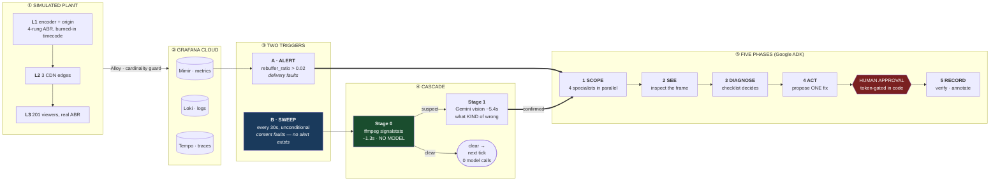
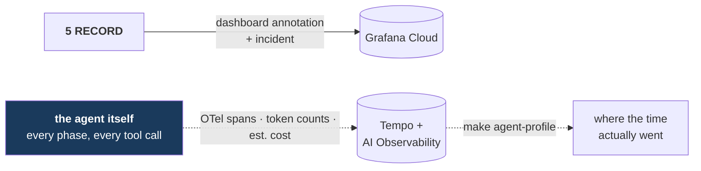

# Architecture

DEAD AIR watches a live video plant the way a broadcast engineer does — by
looking at the picture — and treats delivery telemetry as necessary but not
sufficient. Everything below is built around one measured fact: **during a total
blackout every delivery metric stays green.**

## The whole system

Strictly left to right, and deliberately so: the two edges that point *back* into
Grafana Cloud — the incident record, and the agent's own telemetry — are drawn
separately below, because including them made the layout fold back on itself and
cost more legibility than they bought.

## The reflexive loop

The agent is itself an observable service, emitting its traces, token counts and
estimated cost into the same stack it is investigating. That is not decoration:
**every performance number in this repo was measured by reading the agent's own
traces back out of Tempo**, including the 1831-second vision stall that a
per-request timeout could not catch.

The dotted line back into Tempo is the **reflexive loop**: the agent is itself an
observable service, emitting its own traces, token counts and estimated cost into
the same stack it is investigating. `make agent-profile` reads a run's timing
back out of Tempo — which is how every performance number in this repo was
measured.

## Why two triggers

| | fires on | catches |
| --- | --- | --- |
| **A — alert** | `rebuffer_ratio > 0.02 for 2m` | delivery faults |
| **B — sweep** | a timer, unconditionally | **content faults, which fire no alert ever** |

Trigger B is not a fallback. Under `black_source`, `rebuffer_ratio` reads
**~0.0001 against a 0.02 threshold** — 200× below the line. No threshold is
crossed, so no alert can exist. An alert-driven agent sleeps through the fault
this project is named after. Real broadcast operations run a confidence monitor
for exactly this reason.

## Why the cascade has three stages

Deciding whether a frame is black is **arithmetic**. Deciding what kind of wrong
it is, is worth a model. Separating them is what makes continuous watching
affordable:

| stage | decides | cost | runs |
| --- | --- | --- | --- |
| **0** | is the picture wrong at all | **1.3s, zero model calls** | every tick |
| **1** | what kind of wrong | 5.4s | only behind a Stage 0 suspect |
| **2** | why, and what to do | ~170–320s | only on a confirmed finding |

Before this split, every sweep tick ran a full investigation, so the cadence
floor was the pipeline's own runtime and "catches it in seconds" was untrue at
any interval. A healthy plant now makes **zero** vision calls per hour.

## What is decided by code, not by the model

This is the load-bearing design choice, so it is worth listing exactly:

| decision | decided by | where |
| --- | --- | --- |
| is the picture black | `ffmpeg signalstats` YAVG/YHIGH thresholds | `content_screen.py` |
| does a rung carry its detail | round-trip PSNR ratio | `rung_resolution_check.py` |
| which fault the evidence supports | fixed predicates over collected evidence | `signatures.py` |
| which remediation to propose | fixed fault→action table, via a forced tool call | `act_tools.py` |
| whether it may execute | a token only a human can issue | `act_tools.py` |
| which SLO verifies recovery | fault class, dispatched in code | `act_tools.py` |
| viewer impact | arithmetic over a measured window | `act_tools.py` |

The model ranks hypotheses, explains, and writes for humans. **Evidence decides.**
Where those two disagree, the disagreement is recorded rather than resolved
silently.

## Fault menu

Five faults, each with a measured signature (`docs/plant.md`):

| fault | rebuffer | bitrate | 4xx | visible in pixels? |
| --- | --- | --- | --- | --- |
| `edge_latency` | 0.44, ONE region | drops, that region | none | no |
| `segment_gap` | ~0.05, all | unchanged | **sustained** | no |
| `ladder_collapse` | zero | 3.6→2.0 Mbps, all | **transient, then stops** | no |
| `black_source` | **zero** | unchanged | none | **yes** |
| `ladder_mismatch` | **zero** | unchanged | none | no — code decides |

The bottom two move no delivery metric at all. `ladder_collapse` and
`segment_gap` both produce 404s, so **presence** of 404s separates nothing —
**persistence** does, and the discriminator compares a recent window against an
earlier one.

## Reading order

- [demo-runbook.md](demo-runbook.md) — how to drive it, with measured timings
- [content-screen.md](content-screen.md) — Stage 0's calibration and the timecode trap
- [vision-spike.md](vision-spike.md) — what vision can and cannot see, per model tier
- [agent.md](agent.md) — the five phases in detail
- [plant.md](plant.md) — the plant and the fault menu
- [agent-performance.md](agent-performance.md) — where time and tokens go
- [audit-2026-08-21.md](audit-2026-08-21.md) — 30 verified findings, and what was not verified
